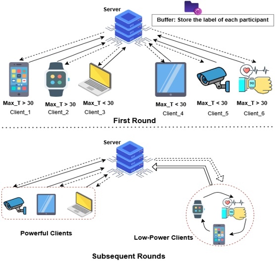

# Straggler-Aware Layer-Wise Low-Latency Federated Learning
 
## Introduction of S3N-FL

  In the original work, the authors proposed Straggler-Aware Layer-Wise Low-Latency Federated Learning (SALF), which leverages the optimization procedure of neural networks via backpropagation to update the global model in a layer-wise fashion. This approach aims to mitigate the impact of stragglers and reduce latency in federated learning systems. The official implementation of SALF is available in this repository. For more details, please refer to their [paper](https://arxiv.org/abs/2403.18375) for more details.

Building upon this foundation, we extend the SALF framework with our proposed method, S3N-FL (Straggler-Staleness Solver with Semi Strategies for Non-IID Data in FL). Our extension is designed to address straggler and staleness challenges while handling extreme Non-IID data distributions. Through extensive experimentation using Dirichlet distributions (α = 0.001, 0.01, 0.05), we demonstrate that S3N-FL performs robustly in heterogeneous and realistic federated learning settings.
 
This code has been tested on Python 3.7.3, PyTorch 1.8.0 and CUDA 11.1.

### Prerequisite
1. PyTorch=1.8.0: https://pytorch.org
2. scipy
3. tqdm
4. matplotlib
5. torchinfo
6. TensorboardX: https://github.com/lanpa/tensorboardX

### Training
```
python main.py --exp_name=salf --stragglers salf --stragglers_percent 0.9 --up_to_layer 1 --data mnist --model mlp
```

### Testing
```
python main.py --exp_name=salf --eval 
```

# S3N-FL: Straggler-Staleness Solver with Semi Strategies for Non-IID Data in FL



## 🔍 Overview

**S3N-FL** is a novel semi-asynchronous Federated Learning (FL) approach designed to address two major challenges in FL:

- **Straggler Clients (Slow Devices)**
- **Stale Updates due to Asynchrony**

It introduces clustering and controlled synchronization mechanisms to balance efficiency and performance in highly heterogeneous and non-IID environments.

---

## 🚀 Key Highlights

- **✅ Addressing Stragglers and Staleness**  
  Effectively mitigates the impact of slow and heterogeneous clients, ensuring more efficient model updates.

- **📉 Reducing Server-Side Communication Overhead**  
  Minimizes communication between straggler clients and the server. By clustering slower clients and synchronizing updates periodically, it reduces the server burden, enhancing efficiency and scalability.

- **⚡ Enhancing Performance in Highly Heterogeneous FL**  
  Demonstrates strong performance in extreme cross-device FL scenarios, effectively handling diverse client capabilities.

- **📊 Handling Extreme Non-IID Data**  
  Works effectively where client data distributions are highly skewed and non-IID, ensuring robust model convergence.

---

## 🧪 Experimental Setup

| **Component**                    | **Details**                       |
|----------------------------------|-----------------------------------|
| **Dataset**                      | CIFAR-10                          |
| **Clients**                      | 30                                |
| **Model**                        | CNN with 8 layers                 |
| **Straggler Rates Tested**       | 0.6, 0.7, 0.8, 0.9                |
| **Non-IID Distribution (Dirichlet)** | 0.001, 0.01, 0.05           |
| **Training Epochs**              | 200                               |

---

